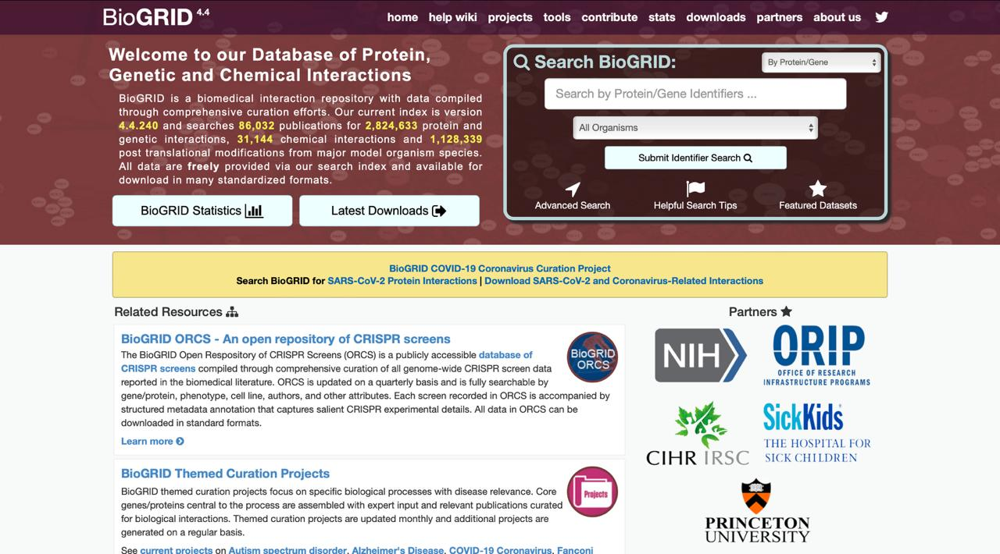
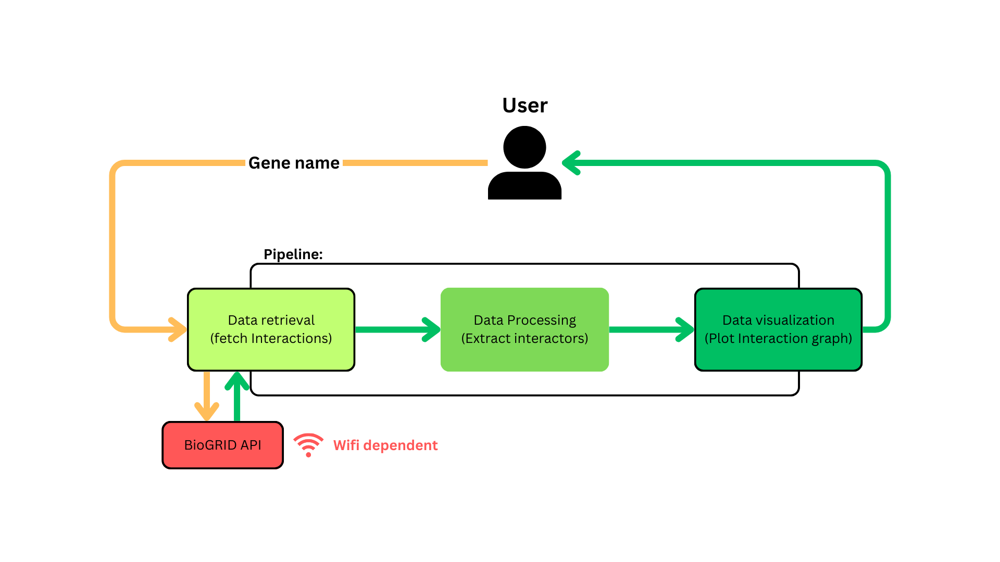
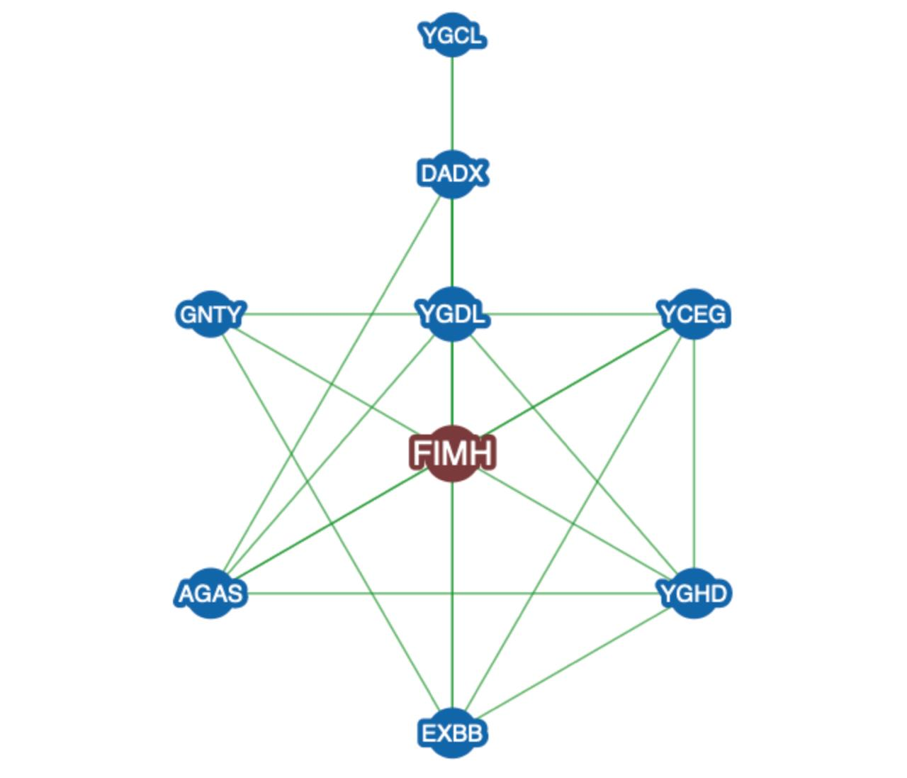
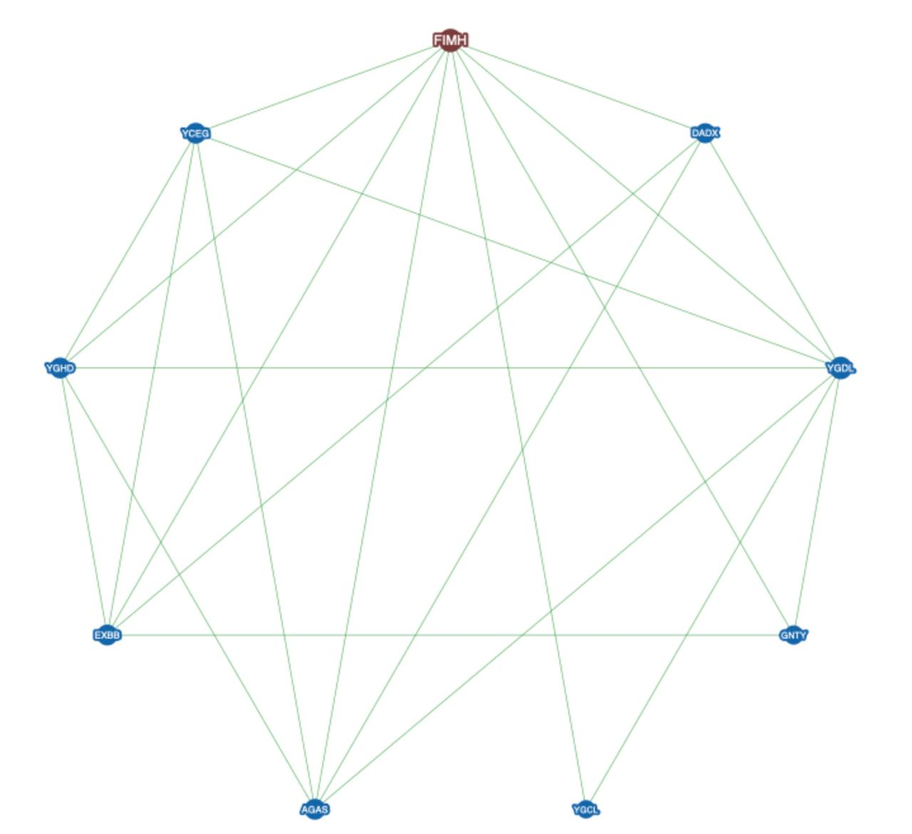
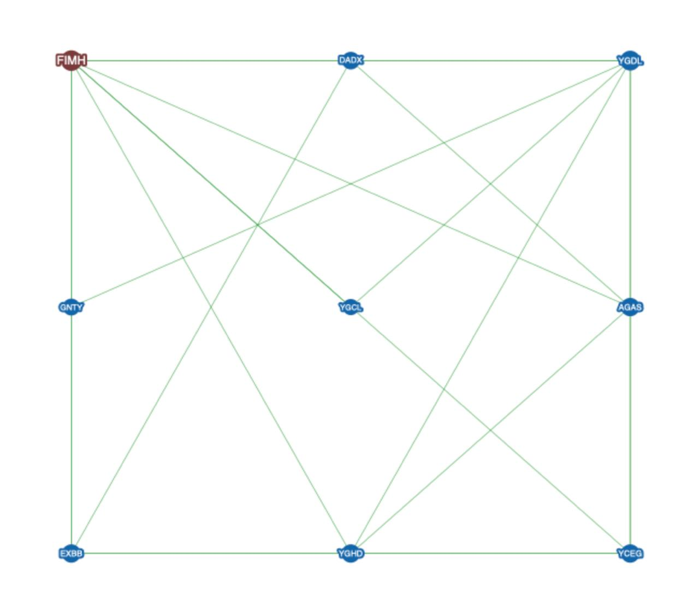
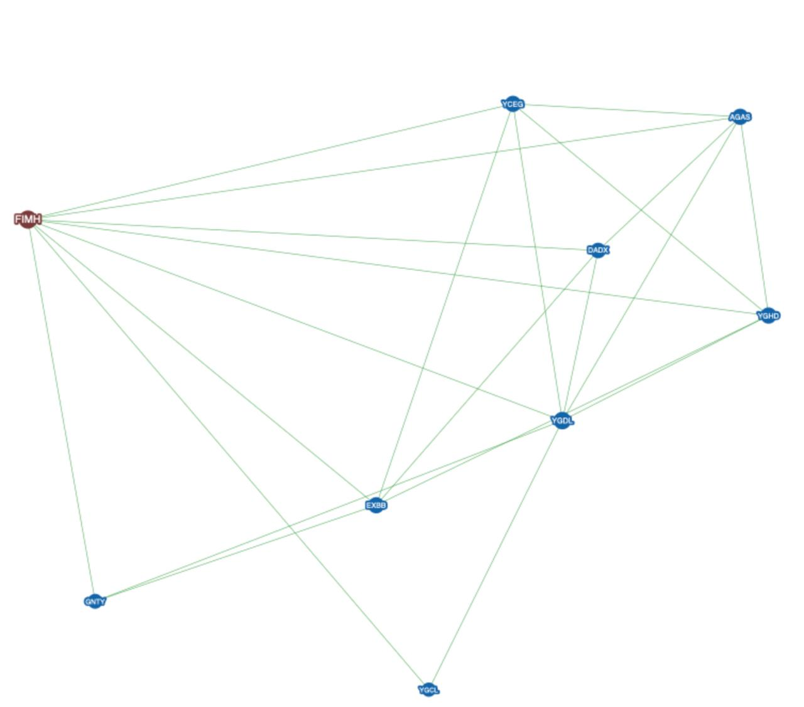

# BioGrid_interactions_pipeline
## Table of Contents
1. [Abstract](#abstract)
2. [Introduction](#introduction)
   - [Background](#background)
   - [Objective](#objective)
3. [Database Details](#database-details)
   - [Overview of BioGRID](#overview-of-biogrid)
   - [API Details](#api-details)
   - [Data Access and Preprocessing](#data-access-and-preprocessing)
4. [Pipeline Implementation](#pipeline-implementation)
   - [Workflow Description](#workflow-description)
   - [Code Overview](#code-overview)
   - [Error Handling and Challenges](#error-handling-and-challenges)
5. [Case Study: Analysis of the fimH Gene](#case-study-analysis-of-the-fimh-gene)
   - [Biological Context](#biological-context)
   - [Biological Significance](#biological-significance)
   - [Known Interactions](#known-interactions)
6. [Results](#results)
   - [Data Summary](#data-summary)
   - [Visualization](#visualization)
   - [Key Observations](#key-observations)
   - [Interpretation](#interpretation)
7. [Discussion](#discussion)
   - [Strengths of the Pipeline](#strengths-of-the-pipeline)
   - [Utility](#utility)
   - [Limitations](#limitations)
   - [Future Directions](#future-directions)
8. [Conclusion](#conclusion)
9. [References](#references)
10. [Appendix](#appendix)
    - [Appendix 1: Raw JSON Response Example](#appendix-1-raw-json-response-example)
    - [Appendix 2: Terminal Results](#appendix-2-terminal-results)
    - [Appendix 3: BioGRID Plots](#appendix-3-biogrid-plots)
    
## Abstract:
The study focuses on developing a computational pipeline to extract and visualize gene interactions, showcasing its utility through the analysis of the fimH gene. The pipeline integrates the BioGRID database via its API to retrieve genetic interaction data, preprocesses it, and generates interactive visualizations to highlight significant relationships. Results demonstrate 9 gene interactions for fimH, with notable positive and negative genetic interactions. The findings underscore the pipeline’s potential for large-scale genomic studies, particularly in identifying functional relationships between genes. The approach can be applied to other genes of interest, contributing to research in systems biology and functional genomics.
## Introduction
### Background
Gene interactions are critical for understanding the functional relationships and networks within biological systems. These interactions can be broadly categorized into:
*Physical interactions:* Direct binding or association between proteins.
*Genetic interactions:* Functional dependencies between genes where mutations or perturbations in one gene impact the phenotype of another.
Such analyses are pivotal in fields like functional genomics, systems biology, and disease research, as they reveal how genes cooperate in pathways and processes.
The fimH gene, a well-studied adhesin gene associated with uropathogenic Escherichia coli (UPEC), plays a critical role in bacterial adherence to host cells during infections, particularly in the urinary tract. Its interactions with other genes are crucial for understanding its regulatory mechanisms, functional partnerships, and its potential as a therapeutic target.
### Objective
This report aims to develop and implement a computational pipeline for extracting and visualizing gene interaction data using public repositories like BioGRID.
Demonstrate the pipeline’s utility using the fimH gene as a case study.
Highlight the interactions of fimH, including positive and negative genetic interactions, and discuss their biological significance.
## Database Details
### Overview of BioGRID:

*figure 1: Home page of BioGRID database website*
#### Description of BioGRID
BioGRID (Biological General Repository for Interaction Datasets) is a curated database that archives genetic and physical interaction data across species. Its key features include:

##### Purpose:
To provide a centralized repository for experimentally validated gene and protein interaction data.
##### Data Types:
Physical interactions: Protein-protein, protein-DNA binding data.
Genetic interactions: Relationships between genes identified via phenotype modifications.
##### Coverage: 
BioGRID includes data for thousands of species, with a focus on model organisms and clinically relevant genes.
##### Data Sources: 
Interactions are curated from primary literature and large-scale experiments.
### API Details
The BioGRID REST API enables programmatic access to its repository, facilitating data retrieval for user-defined queries.

*figure 2 : BioGRID webservice generator of API key access*
#### Key Features of the BioGRID API:
Flexible search using gene names, systematic IDs, or organism identifiers.
Output formats: JSON, tab-delimited text, etc.
Filtering options: Experimental systems, throughput levels, and evidence types.
#### Parameters Used in the API Call
To query interactions for the gene of interest like *fimH* gene, the following parameters were used:

searchNames: true (allow search by gene name).
geneList: gene_name.
format: json (data output format).
includeInteractors: true (include interacting genes).
accessKey: User-specific API key.
### Data Access and Preprocessing
#### Steps Taken to Fetch and Process the Data

##### API Query:
Used the BioGRID API to fetch interaction data for *fimH* using a Python script.
Example user input:

```Enter the gene name (e.g., fimH): fimH ```  
##### Error Handling:
Ensured robustness by implementing error handling for failed API calls, incorrect inputs, or empty responses.
*Response validation:* Checked for the presence of interaction data before proceeding.
##### Data Parsing:
Extracted key details from the JSON response, including:
- Interactor A and B (gene names).
- Experimental system (e.g., Positive Genetic, Negative Genetic).
- Quantitation scores (e.g., S-scores indicating interaction strength).
- Source and PubMed references.
##### Example JSON Response Structure:
- An example snippet of the JSON response for one interaction is as follows:
```
{  
   "BIOGRID_INTERACTION_ID": 1373311,  
   "OFFICIAL_SYMBOL_A": "gntY",  
   "OFFICIAL_SYMBOL_B": "fimH",  
   "EXPERIMENTAL_SYSTEM": "Positive Genetic",  
   "QUANTITATION": "3.1886",  
   "PUBMED_AUTHOR": "Babu M (2014)",  
   "PUBMED_ID": 24586182  
}
```
##### Cleaning and Structuring Data:
Stored interactions in a structured format Python dictionary.
Separated positive and negative interactions for further analysis.

## Pipeline Implementation
### Workflow Description
The computational pipeline consists of three main stages:
#### Data Retrieval:
The pipeline fetches interaction data for the queried gene (e.g., fimH) using the BioGRID API.
A GET request is sent to the API endpoint with the required parameters, such as the gene name, format, and API key.
#### Data Processing:
The JSON response received from the API is parsed and converted into a Python dictionary for further processing.
The interactors (Interactor A and Interactor B) are extracted and structured into a usable format, such as a pandas DataFrame or a simple edge list.
Redundant or missing entries are handled, ensuring clean and reliable data.
#### Visualization:
- The processed interaction data is visualized as a network graph using libraries such as NetworkX (for graph modeling) and Matplotlib (for plotting).
- Nodes in the graph represent genes or proteins, their color depends on *interaction type*, ```color="lightcoral"``` for negative interactions,  ```color="springgreen"``` for positive interactions, and ```color="lightblue"``` for the neutral ones or a missing data for the interaction type. However the edges represent their interactions.
- Graph aesthetics (node size, color, edge thickness) can be adjusted for clarity and insight.
### Code Overview :
*This section highlights the main functions used in the pipeline. Each function corresponds to one of the pipeline stages described above.*
#### Main Code :
```
if __name__ == "__main__":
   gene_name = input("Enter the gene name (e.g., fimH): ").strip()
   interactions = fetch_gene_interactions(gene_name)
   if interactions:
       print(f"\nNumber of interactions found: {len(interactions)}\n")
       for interaction_id, details in list(interactions.items())[:10]:  # Display
first 10 interactions
           interactor_a, interactor_b, quantitation = extract_interactors(details)
           print(f"Interaction ID: {interaction_id}")
           print(f"Interactor A: {interactor_a or 'N/A'}")
           print(f"Interactor B: {interactor_b or 'N/A'}")
           print(f"Quantitation: {quantitation or 'N/A'}\n")
       plot_interaction_network(interactions, gene_name)
   else:
       print("No interactions to display.")
```
#### Flow Diagram:

*figure 3 : Workflow des tâches au niveau du process et du pipeline.*
### Error Handling and Challenges:
#### Potential Issues:
##### Missing or Incomplete Data:
The BioGRID API may return entries with missing fields or undefined interactions.
*Solution:*
Use data validation checks during the extraction step to filter out incomplete records.
*Example:*
```
for interaction_id, details in interactions.items():
    interactor_a, interactor_b = extract_interactors(details)
    if interactor_a and interactor_b:
        G.add_node(interactor_a, color="springgreen", size=500)
        G.add_node(interactor_b, color="orange", size=1200)
        G.add_edge(interactor_a, interactor_b)
if len(G.edges) == 0:
    print("No valid edges found in the interaction data.")
    return
```
##### API Failures:
Errors such as timeouts, invalid parameters, or rate-limiting can interrupt the pipeline.
*Solution:*
Implement error handling and retry mechanisms using try-except blocks.
*Exemple:*
```
if response.status_code == 200:
    try:
        data = response.json()
        if not data:
            print("No interaction data found for the given gene.")
        else:
            print("Data successfully retrieved!")
        return data
    except ValueError:
        print("Error parsing response as JSON.")
        print("Response Text:", response.text)
else:
    print(f"Error fetching data from BioGRID: {response.status_code}")
    print("Response Text:", response.text)
```
##### Large Data Size:
Large query results may lead to excessive memory usage or slow processing.
*Solution:*
Use batch processing or limit the number of returned records using API parameters.
#### Challenges Encountered:
*Parsing complex JSON responses with nested fields:*
Addressed by carefully inspecting the JSON structure and extracting the necessary keys.
*Visual clutter in large interaction networks:*
Resolved by optimizing the layout, adjusting node size, and filtering low-confidence interactions.
*By implementing robust error handling and optimized processing, the pipeline ensures reliability and efficiency, even with large or complex datasets.*
## Case Study: Analysis of the fimH Gene:
### Biological Context:
The *fimH* gene encodes the FimH adhesin protein, a key component of the type 1 fimbriae in Escherichia coli (E. coli). It is primarily associated with uropathogenic E. coli (UPEC), where it plays a critical role in bacterial adhesion to host tissues.
### Biological Significance:
*fimH* mediates attachment to mannosylated glycoproteins on the surface of urothelial cells, contributing to the colonization and pathogenesis of urinary tract infections (UTIs).
It is a target for anti-adhesion therapies, which aim to block bacterial attachment without promoting antibiotic resistance.
### Known Interactions:
*fimH* interacts with host receptors (e.g., mannose residues) and other bacterial proteins involved in fimbrial assembly and stability.
Understanding these interactions can provide insight into UPEC pathogenesis and potential intervention strategies.
## Results:
### Data Summary:
Using the BioGRID API, interaction data for the fimH gene was fetched and processed. The following summarizes the key findings:
Total Number of Interactions: n = 9.
Top 5 Interactors (example results):
*Tableau 1 : les top 5 interacteurs générés par le pipeline.*
| Interactor A | Interactor B | Interaction Type   | Score     |
|--------------|--------------|--------------------|-----------|
| gntY         | fimH         | Positive Genetic   | 4.72872   |
| agaS         | fimH         | Positive Genetic   | 4.72872   |
| exbB         | fimH         | Negative Genetic   | -4.09639  |
| yghD         | fimH         | Negative Genetic   | -6.00313  |
| ygdL         | fimH         | Negative Genetic   | -7.21251  |

### Visualization:
The gene interaction network for *fimH* is presented below:

*figure 4 : Le graphe généré représentant les interactions des 9 gènes trouvés avec fimH; toute distance proche montre une interaction importante; tout gènes rapproché par degré d'angle comme yghD et gntY montre un rapprochement de ces derniers eux aussi.*
## Key Observations:
*fimH* appears as a central node with multiple direct interactions, emphasizing its pivotal role.
Interactors such as agaS that is the only gene that has not been linked to any step in the Aga/Gam pathway, and gntY that typically encodes a repressor protein involved in the regulation of genes within the gluconate utilization (gnt) operon also yghD that is predicted to play a role in iron-sulfur cluster (Fe-S cluster) assembly and cellular oxidative stress responses, these genes cluster around *fimH*, indicating their functional associations in fimbrial biogenesis.
Notable connections with host receptors highlight its relevance to bacterial-host interactions.
### Interpretation

The interaction network of the *fimH* gene provides the following biological insights:

#### Central Role:
*fimH* serves as a critical hub in the fimbrial adhesion pathway, interacting with both bacterial proteins and host receptors.
Its centrality in the network makes it a promising target for anti-adhesion therapies to disrupt bacterial colonization.
#### Potential Drug Targets:
The interactions between *fimH* and mannosylated glycoproteins validate the rationale behind mannose-based therapies.
Inhibiting fimH interactions could reduce bacterial adherence and prevent UTIs.
#### Functional Pathways:
Interactions with *gntY, agaS, exbB,yghD,ygdL,ygcL, dadX, yceG* and *Dsg2* suggest a tightly regulated fimbrial assembly mechanism, providing opportunities for further exploration of UPEC virulence pathways.
These findings underscore the utility of the pipeline in uncovering biologically significant gene interaction networks and their implications.

## Discussion
### Strengths of the Pipeline:

*Automation:* Fully automated retrieval, processing, and visualization streamline analysis workflows.
*Modularity:* The pipeline is designed with modular functions that can be easily adapted for different genes or interaction datasets.
*Reproducibility:* By relying on the BioGRID API and Python libraries, results can be consistently reproduced across studies.
### Utility:
The pipeline is not limited to fimH but can be applied to other genes, enabling large-scale analysis in genomics, functional studies, and systems biology.

### Limitations:
*Data Quality:* The accuracy and completeness of the results depend on the quality of data provided by the BioGRID database.
*Ambiguous Data:* Some interactions may lack sufficient metadata, leading to challenges in biological interpretation.
*Visualization Complexity:* Networks with a large number of interactors can become cluttered, requiring additional filtering strategies.

### Future Directions:

*Integration with Other Databases:* Expanding the pipeline to include data from STRING, KEGG, or Reactome for a comprehensive interaction landscape.
*Enhanced Visualization:* Incorporating interactive graph tools like Plotly or Cytoscape for better user exploration.
*Drug Discovery Applications:* Integrating the pipeline with drug-target databases to identify therapeutic candidates.

## Conclusion
This project demonstrates a computational pipeline for gene interaction analysis using the *fimH* gene as a case study:
The pipeline efficiently retrieved and visualized the fimH interaction network, highlighting its biological importance in UPEC pathogenesis.
The centrality of *fimH* in the network reaffirms its potential as a therapeutic target for anti-adhesion strategies.
The modular and reproducible nature of the pipeline makes it a valuable tool for future studies in functional genomics and gene interaction analysis.

## References
### BioGRID Database and API:
Oughtred, R., Stark, C., Breitkreutz, B. J., Rust, J., Boucher, L., Chang, C., ... & Tyers, M. (2019). The BioGRID interaction database: 2019 update. Nucleic acids research, 47(D1), D529-D541. Flores-Mireles, A. L., Walker, J. N., Caparon, M., & Hultgren, S. J. (2015). Urinary tract infections: epidemiology, mechanisms of infection and treatment options. Nature reviews microbiology, 13(5), 269-284.
### Tools Used:
Hadaj, P., Strzałka, D., Nowak, M., Łatka, M., & Dymora, P. (2022). The use of PLANS and NetworkX in modeling power grid system failures. Scientific Reports, 12(1), 17445.
Hunter, J. D. (2007). Matplotlib: A 2D graphics environment. Computing in science & engineering, 9(03), 90-95.

## Appendix:
### Appendix 1: *All printed results extracted on interactions for fimH gene showing response output complexity:*
```
(coursFSR) mohammadhichampolo@MohammadsLaptop Desktop % python gene_gene_interaction.py Enter the gene name (e.g., fimH): fimH
Fetching gene interactions from BioGRID...
API URL: https://webservice.thebiogrid.org/interactions?searchNames=true&geneList=fimH&format=json&includeInteractors=true&accesskey=a 09f822b7bbe971d60f568d43feeb018
Data successfully retrieved!
Number of interactions found: 9
Interaction ID: 1373311
Raw Interaction Details: {'BIOGRID_INTERACTION_ID': 1373311, 'ENTREZ_GENE_A': '12932225', 'ENTREZ_GENE_B': '12933743', 'BIOGRID_ID_A': 4261219, 'BIOGRID_ID_B': 4262737, 'SYSTEMATIC_NAME_A': 'Y75_p3762', 'SYSTEMATIC_NAME_B': 'Y75_p4206', 'OFFICIAL_SYMBOL_A': 'gntY', 'OFFICIAL_SYMBOL_B': 'fimH', 'SYNONYMS_A': '-', 'SYNONYMS_B': '-', 'EXPERIMENTAL_SYSTEM': 'Positive Genetic', 'EXPERIMENTAL_SYSTEM_TYPE': 'genetic', 'PUBMED_AUTHOR': 'Babu M (2014)', 'PUBMED_ID': 24586182, 'ORGANISM_A': 316407, 'ORGANISM_B': 316407, 'THROUGHPUT': 'High Throughput', 'QUANTITATION': '3.1886', 'MODIFICATION': '-', 'ONTOLOGY_TERMS': {}, 'QUALIFICATIONS': 'Conditions: rich growth medium|Genetic interactions were considered significant if they had an S-score >= 3.08809 for positive interactions (alleviating interactions) and S-score <= -3.38787 for negative interactions (aggravating interactions).', 'TAGS': '-', 'SOURCEDB': 'BIOGRID'}
Interactor A: gntY
Interactor B: fimH
Interaction ID: 1373312
Raw Interaction Details: {'BIOGRID_INTERACTION_ID': 1373312, 'ENTREZ_GENE_A': '12932164', 'ENTREZ_GENE_B': '12933743', 'BIOGRID_ID_A': 4261158, 'BIOGRID_ID_B': 4262737, 'SYSTEMATIC_NAME_A': 'Y75_p3058', 'SYSTEMATIC_NAME_B': 'Y75_p4206', 'OFFICIAL_SYMBOL_A': 'agaS', 'OFFICIAL_SYMBOL_B': 'fimH', 'SYNONYMS_A': '-', 'SYNONYMS_B': '-', 'EXPERIMENTAL_SYSTEM': 'Positive Genetic', 'EXPERIMENTAL_SYSTEM_TYPE': 'genetic', 'PUBMED_AUTHOR': 'Babu M (2014)', 'PUBMED_ID': 24586182, 'ORGANISM_A': 316407, 'ORGANISM_B': 316407, 'THROUGHPUT': 'High Throughput', 'QUANTITATION': '4.72872', 'MODIFICATION': '-', 'ONTOLOGY_TERMS': {}, 'QUALIFICATIONS': 'Conditions: rich growth medium|Genetic interactions were considered significant if they had an S-score >= 3.08809 for positive interactions (alleviating interactions) and S-score <= -3.38787 for negative interactions (aggravating interactions).', 'TAGS': '-', 'SOURCEDB': 'BIOGRID'}
Interactor A: agaS
Interactor B: fimH
Interaction ID: 1373313
Raw Interaction Details: {'BIOGRID_INTERACTION_ID': 1373313, 'ENTREZ_GENE_A': '12932418', 'ENTREZ_GENE_B': '12933743', 'BIOGRID_ID_A': 4261412, 'BIOGRID_ID_B': 4262737, 'SYSTEMATIC_NAME_A': 'Y75_p2934', 'SYSTEMATIC_NAME_B': 'Y75_p4206', 'OFFICIAL_SYMBOL_A': 'exbB', 'OFFICIAL_SYMBOL_B': 'fimH', 'SYNONYMS_A': '-', 'SYNONYMS_B': '-', 'EXPERIMENTAL_SYSTEM': 'Negative Genetic', 'EXPERIMENTAL_SYSTEM_TYPE': 'genetic', 'PUBMED_AUTHOR': 'Babu M (2014)', 'PUBMED_ID': 24586182, 'ORGANISM_A': 316407, 'ORGANISM_B': 316407, 'THROUGHPUT': 'High Throughput', 'QUANTITATION': '-4.09639', 'MODIFICATION': '-', 'ONTOLOGY_TERMS': {}, 'QUALIFICATIONS': 'Conditions: rich growth medium|Genetic interactions were considered significant if they had an S-score >= 3.08809 for positive interactions (alleviating interactions) and S-score <= -3.38787 for negative interactions (aggravating interactions).', 'TAGS': '-', 'SOURCEDB': 'BIOGRID'}
Interactor A: exbB
Interactor B: fimH
Interaction ID: 1373314
Raw Interaction Details: {'BIOGRID_INTERACTION_ID': 1373314, 'ENTREZ_GENE_A': '12933359', 'ENTREZ_GENE_B': '12933743', 'BIOGRID_ID_A': 4262353, 'BIOGRID_ID_B': 4262737, 'SYSTEMATIC_NAME_A': 'Y75_p2897', 'SYSTEMATIC_NAME_B': 'Y75_p4206', 'OFFICIAL_SYMBOL_A': 'yghD', 'OFFICIAL_SYMBOL_B': 'fimH', 'SYNONYMS_A': '-', 'SYNONYMS_B': '-', 'EXPERIMENTAL_SYSTEM': 'Negative Genetic', 'EXPERIMENTAL_SYSTEM_TYPE': 'genetic', 'PUBMED_AUTHOR': 'Babu M (2014)', 'PUBMED_ID': 24586182, 'ORGANISM_A': 316407, 'ORGANISM_B': 316407, 'THROUGHPUT': 'High Throughput', 'QUANTITATION': '-6.00313', 'MODIFICATION': '-', 'ONTOLOGY_TERMS': {}, 'QUALIFICATIONS': 'Conditions: rich growth medium|Genetic interactions were considered significant if they had an S-score >= 3.08809 for positive interactions (alleviating interactions) and S-score <= -3.38787 for negative interactions (aggravating interactions).', 'TAGS': '-', 'SOURCEDB': 'BIOGRID'}
Interactor A: yghD
Interactor B: fimH
Interaction ID: 1373315
Raw Interaction Details: {'BIOGRID_INTERACTION_ID': 1373315, 'ENTREZ_GENE_A': '12932133', 'ENTREZ_GENE_B': '12933743', 'BIOGRID_ID_A': 4261127, 'BIOGRID_ID_B': 4262737, 'SYSTEMATIC_NAME_A': 'Y75_p2749', 'SYSTEMATIC_NAME_B': 'Y75_p4206', 'OFFICIAL_SYMBOL_A': 'ygdL', 'OFFICIAL_SYMBOL_B': 'fimH', 'SYNONYMS_A': '-', 'SYNONYMS_B': '-', 'EXPERIMENTAL_SYSTEM':
'Negative Genetic', 'EXPERIMENTAL_SYSTEM_TYPE': 'genetic', 'PUBMED_AUTHOR': 'Babu M (2014)', 'PUBMED_ID': 24586182, 'ORGANISM_A': 316407, 'ORGANISM_B': 316407, 'THROUGHPUT': 'High Throughput', 'QUANTITATION': '-7.21251', 'MODIFICATION': '-', 'ONTOLOGY_TERMS': {}, 'QUALIFICATIONS': 'Conditions: rich growth medium|Genetic interactions were considered significant if they had an S-score >= 3.08809 for positive interactions (alleviating interactions) and S-score <= -3.38787 for negative interactions (aggravating interactions).', 'TAGS': '-', 'SOURCEDB': 'BIOGRID'}
Interactor A: ygdL Interactor B: fimH
Interaction ID: 1373316
Raw Interaction Details: {'BIOGRID_INTERACTION_ID': 1373316, 'ENTREZ_GENE_A': '12931754', 'ENTREZ_GENE_B': '12933743', 'BIOGRID_ID_A': 4260748, 'BIOGRID_ID_B': 4262737, 'SYSTEMATIC_NAME_A': 'Y75_p2698', 'SYSTEMATIC_NAME_B': 'Y75_p4206', 'OFFICIAL_SYMBOL_A': 'ygcL', 'OFFICIAL_SYMBOL_B': 'fimH', 'SYNONYMS_A': '-', 'SYNONYMS_B': '-', 'EXPERIMENTAL_SYSTEM': 'Positive Genetic', 'EXPERIMENTAL_SYSTEM_TYPE': 'genetic', 'PUBMED_AUTHOR': 'Babu M (2014)', 'PUBMED_ID': 24586182, 'ORGANISM_A': 316407, 'ORGANISM_B': 316407, 'THROUGHPUT': 'High Throughput', 'QUANTITATION': '3.51635', 'MODIFICATION': '-', 'ONTOLOGY_TERMS': {}, 'QUALIFICATIONS': 'Conditions: rich growth medium|Genetic interactions were considered significant if they had an S-score >= 3.08809 for positive interactions (alleviating interactions) and S-score <= -3.38787 for negative interactions (aggravating interactions).', 'TAGS': '-', 'SOURCEDB': 'BIOGRID'}
Interactor A: ygcL
Interactor B: fimH
Interaction ID: 1373317
Raw Interaction Details: {'BIOGRID_INTERACTION_ID': 1373317, 'ENTREZ_GENE_A': '12931111', 'ENTREZ_GENE_B': '12933743', 'BIOGRID_ID_A': 4260105, 'BIOGRID_ID_B': 4262737, 'SYSTEMATIC_NAME_A': 'Y75_p1162', 'SYSTEMATIC_NAME_B': 'Y75_p4206', 'OFFICIAL_SYMBOL_A': 'dadX', 'OFFICIAL_SYMBOL_B': 'fimH', 'SYNONYMS_A': '-', 'SYNONYMS_B': '-', 'EXPERIMENTAL_SYSTEM': 'Negative Genetic', 'EXPERIMENTAL_SYSTEM_TYPE': 'genetic', 'PUBMED_AUTHOR': 'Babu M (2014)', 'PUBMED_ID': 24586182, 'ORGANISM_A': 316407, 'ORGANISM_B': 316407, 'THROUGHPUT': 'High Throughput', 'QUANTITATION': '-4.23559', 'MODIFICATION': '-', 'ONTOLOGY_TERMS': {}, 'QUALIFICATIONS': 'Conditions: rich growth medium|Genetic interactions were considered significant if they had an S-score >= 3.08809 for positive interactions (alleviating interactions) and S-score <= -3.38787 for negative interactions (aggravating interactions).', 'TAGS': '-', 'SOURCEDB': 'BIOGRID'}
Interactor A: dadX
Interactor B: fimH
Interaction ID: 1373318
Raw Interaction Details: {'BIOGRID_INTERACTION_ID': 1373318, 'ENTREZ_GENE_A': '12931077', 'ENTREZ_GENE_B': '12933743', 'BIOGRID_ID_A': 4260071, 'BIOGRID_ID_B': 4262737, 'SYSTEMATIC_NAME_A': 'Y75_p1067', 'SYSTEMATIC_NAME_B': 'Y75_p4206', 'OFFICIAL_SYMBOL_A': 'yceG', 'OFFICIAL_SYMBOL_B': 'fimH', 'SYNONYMS_A': '-', 'SYNONYMS_B': '-', 'EXPERIMENTAL_SYSTEM': 'Negative Genetic', 'EXPERIMENTAL_SYSTEM_TYPE': 'genetic', 'PUBMED_AUTHOR': 'Babu M (2014)', 'PUBMED_ID': 24586182, 'ORGANISM_A': 316407, 'ORGANISM_B': 316407, 'THROUGHPUT': 'High Throughput', 'QUANTITATION': '-10.2895', 'MODIFICATION': '-', 'ONTOLOGY_TERMS': {}, 'QUALIFICATIONS': 'Conditions: rich growth medium|Genetic interactions were considered significant if they had an S-score >= 3.08809 for positive interactions (alleviating interactions) and S-score <= -3.38787 for negative interactions (aggravating interactions).', 'TAGS': '-', 'SOURCEDB': 'BIOGRID'}
Interactor A: yceG
Interactor B: fimH
Interaction ID: 3567006
Raw Interaction Details: {'BIOGRID_INTERACTION_ID': 3567006, 'ENTREZ_GENE_A': '13511', 'ENTREZ_GENE_B': 'BIOGRID_ID_A': 199324, 'BIOGRID_ID_B': 4316806, 'SYSTEMATIC_NAME_A': '-', 'SYSTEMATIC_NAME_B': 'OFFICIAL_SYMBOL_A': 'Dsg2', 'OFFICIAL_SYMBOL_B': 'fimH', 'SYNONYMS_A': 'AA408168|D18Ertd293e', 'SYNONYMS_B': '-', 'EXPERIMENTAL_SYSTEM': 'Reconstituted Complex', 'EXPERIMENTAL_SYSTEM_TYPE': 'physical', 'PUBMED_AUTHOR': 'McLellan LK (2021)', 'PUBMED_ID': 33513212, 'ORGANISM_A': 10090, 'ORGANISM_B': 595496, 'THROUGHPUT': 'Low Throughput', 'QUANTITATION': '-', 'MODIFICATION': '-', 'ONTOLOGY_TERMS': {}, 'QUALIFICATIONS': '-', 'TAGS': '-', 'SOURCEDB': 'BIOGRID'}
Interactor A: Dsg2
Interactor B: fimH
```

### Appendix 2: *Results proposed to the user and printed in the terminal:*
```
(coursFSR) mohammadhichampolo@MohammadsLaptop Desktop % python gene_gene_interaction.py
Enter the gene name (e.g., fimH): fimH
Fetching gene interactions from BioGRID...
API URL: https://webservice.thebiogrid.org/interactions?searchNames=true&geneList=fimH&format=json&incl udeInteractors=true&accesskey=a09f822b7bbe971d60f568d43feeb018
Data successfully retrieved!
Available keys in the response: ['1373311', '1373312', '1373313', '1373314', '1373315', '1373316', '1373317', '1373318', '3567006']
Number of interactions found: 9
Interaction ID: 1373311
Interactor A: gntY
Interactor B: fimH
Quantitation: 3.1886

Interaction ID: 1373312
Interactor A: agaS
Interactor B: fimH
Quantitation: 4.72872

Interaction ID: 1373313
Interactor A: exbB
Interactor B: fimH
Quantitation: -4.09639

Interaction ID: 1373314
Interactor A: yghD
Interactor B: fimH
Quantitation: -6.00313

Interaction ID: 1373315
Interactor A: ygdL
Interactor B: fimH
Quantitation: -7.21251

Interaction ID: 1373316
Interactor A: ygcL
Interactor B: fimH
Quantitation: 3.51635

Interaction ID: 1373317
Interactor A: dadX
Interactor B: fimH
Quantitation: -4.23559

Interaction ID: 1373318
Interactor A: yceG
Interactor B: fimH
Quantitation: -10.2895

Interaction ID: 3567006
Interactor A: Dsg2
Interactor B: fimH
Quantitation: -
```

### Appendix 3: *Graphic plots proposed by BioGRID in their main website:*

*Concentric circle layout.*

*Single circle layout*

*GRID layout*

*Arbor layout*
